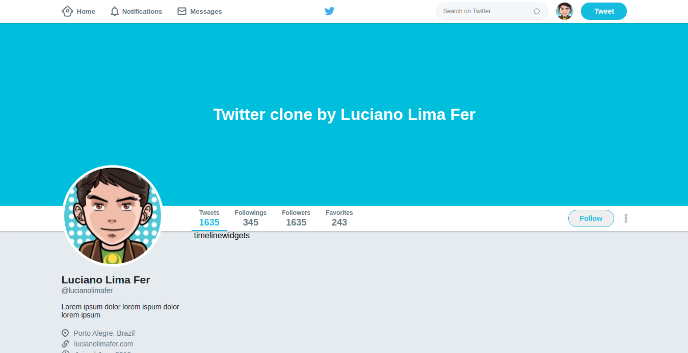

<h1 align="center">
    
</h1>

<h1 align="center">
   💻 <a href="#"> Twitter Clone (simple css with flex-box) </a>
</h1>

<h3 align="center">
    Training css skills with flex-box. Learning acquired in a fast course by Rocketseat! #goStack
</h3>

<h4 align="center"> 
	 Status: Training...
</h4>

---

## License

This project is under the license [MIT](./LICENSE).

Made with love by Luciano Lima Fer 👋🏽 [Get in Touch!](https://www.linkedin.com/in/luciano-lima-ferreira-71846495/)

